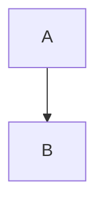

---
{"cssclass":"kanban","dg-home":true,"dg-publish":true,"permalink":"/Home/","tags":["gardenEntry"],"dgPassFrontmatter":true,"noteIcon":""}
---

- 1
	- [[3 项目/Datawhale/lightGBM的数学原理\|lightGBM的数学原理]]
	- [[3 项目/Datawhale/Datawhale\|Datawhale]]
	- fff
	- ss
- 2
	- fjksf
	- ss

