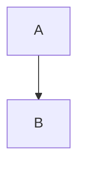

---
{"cssclass":"kanban","dg-home":true,"dg-publish":true,"permalink":"/Home/","tags":["gardenEntry"],"dgPassFrontmatter":true,"noteIcon":""}
---

[toc]
- 1
	- [[3 项目/Datawhale/lightGBM的数学原理\|lightGBM的数学原理]]
	- [[3 项目/Datawhale/Datawhale\|Datawhale]]
	- fff
	- ss
- 2
	- fjksf
	- ss

- **RoboCup 赛区：**

（一）RoboCup 足球机器人比赛

类人组

中型组

仿真 2D 组

仿真 3D 组

（二）RoboCup 救援组比赛

救援机器人组

救援仿真组

**中国机器人大赛赛区：**

篮球机器人

机器人先进视觉赛

自动分拣机器人

FIRA 小型组

水下机器人

救援机器人

中型组仿真赛

智能车挑战赛

无人机挑战赛

